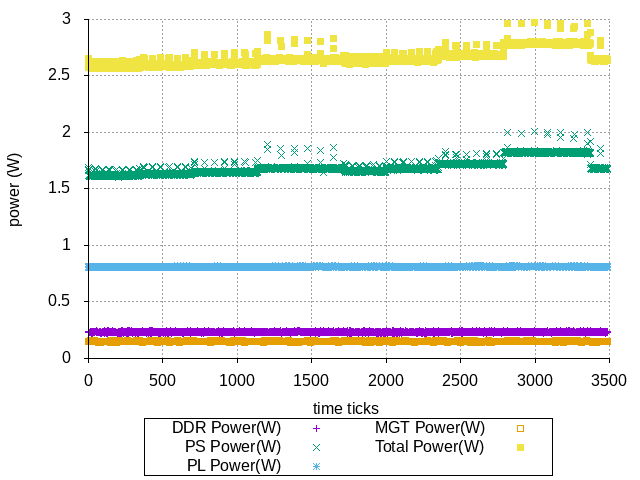

# Power profiling

# Power profiling for CPUs

The following steps, implemented in the `cpu-power-profiling.sh` script, were done to get the power consumption from the zcu102 processors (PS):
 - The island is set to `userspace` governor
 - Launch the power sampler with &
 - Set idle workload
 - For each frequency
    - Set the CPU frequency
    - Wait for 30 seconds
 - Set high workload using four `yes` processes
 - For each frequency
    - Set the CPU frequency
    - Wait for 30 seconds
 - kill all `yes` processes
 - kill the power sampler

Running this script generated the follwing plots:

And the following table after running the script `split-average.sh`:

|  Freq (MHz)        | Idle Power (W)  | Busy Power(W)  |
|--------------------|-----------------|----------------|
|      			1200 |         1.68179 | 	    2.16797 |
| 			     600 |         1.64398 |        1.87808 |
| 			     400 |         1.62836 |        1.77113 |
| 			     300 |         1.62087 |        1.72494 |

# Power profiling PL in idle

Using the same script above, PL idle power is **0.815439**.

## Power down unused blocks

 - TBD: [powerdown RPU and GPU](https://xilinx-wiki.atlassian.net/wiki/spaces/A/pages/1417150870/Power+Down+Unused+Blocks)